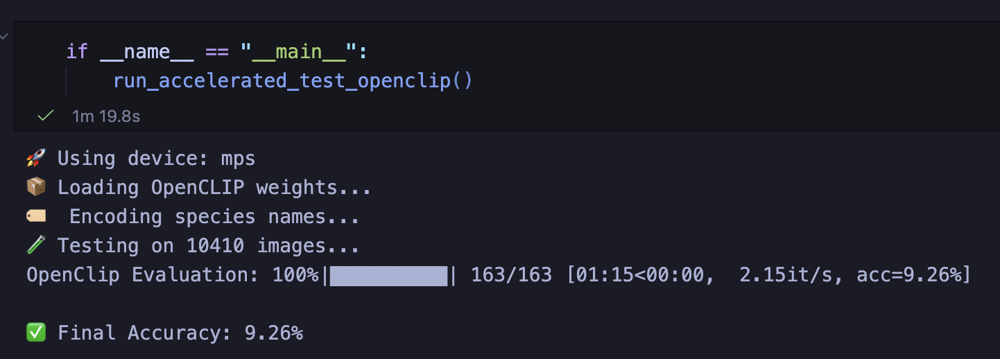
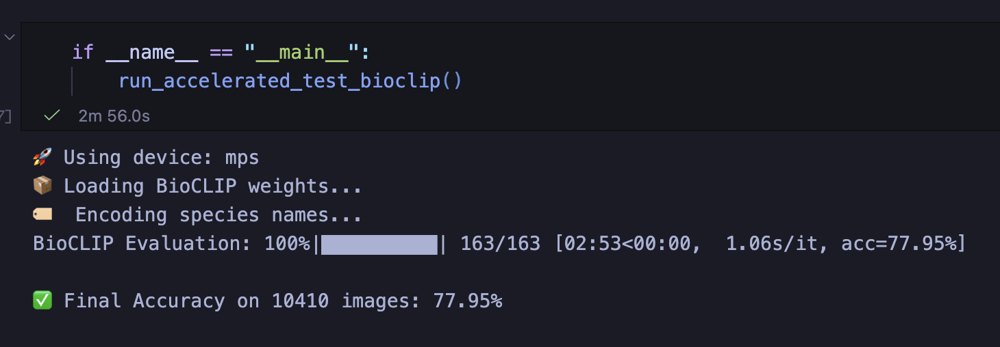

# MushroomCLIP project


[Image credit](https://blog.mdpi.com/2023/02/21/importance-of-mushrooms/)

## Introduction

The aim of this project is to fine-tune an existing open source version of the CLIP model [[1]](https://arxiv.org/abs/2103.00020), developed originally by OpenAI and later open-sourced by various contributers under the name OpenCLIP and compare it's performance to a previously created adaption called BioCLIP [[2]](https://arxiv.org/abs/2311.18803), which has been trained on a dataset consisting of 10M images of plants, animals, and fungi, as well as the structured biological knowledge. Since the creation of the first BioCLIP model, there has been a version 2 released, which increased the size of the training data to 200M images.

The goal was to see, if fine-tuning a similarly sized model with specific domain knowledge, which in this project was knowledge about various classes of mushrooms, could perform equally or even better then a model trained much more intently on a much larger dataset.

## Data

### Acquisition

The dataset consisting of ~100'000 images of different mushroom classes was adapted from a previously created Kaggle challenge [[3]](https://www.kaggle.com/datasets/zlatan599/mushroom1). After downloading the dataset, the final size came out to 12.2 GB of data made up of 169 individual classes of mushrooms spanning a total of 104'100 images. We split the data into three different parts: training (80%), testing (10%) and validation (10%). Initial analysis of the dataset did not reveal any imbalances to be taken care of so we agreed to continue to benchmarking the selected models before fine-tuning, to assess their zero-shot capabilities before any fine-tuning.

### Benchmarking

Benchmarking the models without any modififiactions yielded interesting results:

- The BioCLIP model had a final accuracy of 77.95% accuracy
- The OpenCLIP model had a final accuracy of 9.26% accuracy

<!-- decide wether to keep or remove the images... -->
<!--   -->

These benchmarking tests clearly showed that when using a model not specifically trained on biological data, but rather on a dataset consisting of various data types, it lacked the needed domain knowledge for high accuracy class prediction.

Based on this already developed framework we started working on the data import and pre-processing scripts that collect and format the data for further use.

### Preprocessing

```python
preprocessing.py
```

Talk about the preprocessing script

## Model

### Model versions

The BioCLIP model we chose to use was the original version [[4]](https://huggingface.co/imageomics/bioclip), which was trained on the 'TreeOfLife-10M' dataset. The basis of this model is the CLIP model version 'ViT-14/L' [[5]](https://huggingface.co/openai/clip-vit-base-patch16) trained on on a proprietary 'WIT-400M' dataset by OpenAI. Compared to the first BioCLIP iteration, the second version called 'bioclip-2' contains significantly more parameters (86M vs 304M) [[6]](https://imageomics.github.io/bioclip/),[[7]](https://arxiv.org/abs/2505.23883). Because we were unsure wether we wanted to scope to the project to include fine-tuning both a CLIP as well as a BioCLIP model, we chose to stick with the smaller sized 'BioCLIP' model, instead of the much larger 'bioclip-2'.

The CLIP model we chose to use was the 'ViT-B-32' version, which was trained on the same proprietary 'WIT-400M' dataset from OpenAI, though the model weights are available [[8]](https://huggingface.co/openai/clip-vit-base-patch32/tree/main). The reason behind not choosing the same 'ViT-14/L' model as our basis was because we wanted to see if using a model using a larger patch size could still retain enough details from the training to perform well enough, without having to invest the computational load to fine-tune the finer grained model.

### Training/fine-tuning

After gathering these first insights into the models behaviour it was decided to move on to training the selected CLIP model using a fine-tuning approach. During the lectures from the CO5 course, we have alrady learned about using Low-Rank Adaptation (LoRA) [[9]](https://arxiv.org/abs/2106.09685) for efficient model tuning. We searched for a framework that allowed us to use LoRA in a straightforward way without having to develop our own system and found the 'peft' library developed by huggingface [[10]](https://huggingface.co/blog/peft),[[11]](https://arxiv.org/abs/2312.12148) that allows for the easy implementation of different fine-tuning approaches into an already existing training + inference loop.

### Experimentation

```python
tuning.py
```

```python
training.py
```

Talk about how we set up the tuning using the peft and LoRA setups and how we fed those into our training and inference loop.

## Results

```python
visualize.py
```

Show the graphs that we generated for testing accuracy

## Project grading

From the MSLS pdf:

- [x] Choose a task that can be solved with common gen AI model discussed in the course. Unorthodox and risky yet sound tasks whose result would be difficult to assess are also welcomed. Explain the task to be solved. (5 scores) *Used models from the CLIP family, but adapted them using a previously created framework*

- [x] Search for an appropriate data set for your task. Describe the dataset. (5 scores) -> *used Kaggle dataset for the project and explained it's content*

- [x] Point out, possibly, related work, problems, or tasks in the literature. (5 scores) -> *Talked about the creation of BioCLIP model in the introduction*

- [x] Preprocess your data and explain the process. (5 scores) -> *Talk about the preprocessing script*

- [ ] Explain your model, the model architecture, parameters, methods, etc. (5 scores)

- [ ] Experiment with your model. Change it, tune hyperparameters, etc. Do not copy-paste a model without substantially adopting it to your task. Explain your final model. (15 scores)

- [ ] Explain and visualize your results. (5 scores)

- [ ] List the lessons you learned and challenges you faced during the project. Point out further work or ideas. (5 scores)

## Repository architecture

The repository structure is organized like this:

```text
CO5_image_classification_project/
├── data/ 
├── img/ 
├── src/ 
│ ├── preprocessing.py
│ ├── tuning.py
│ └── evaluation.py
├── project.ipynb
├── .devcontainer
├── .gitignore
├── config.yaml
├── requirements.txt
└── README.md
```

<!-- ## Repository overview

This project provides a [VS Code Dev Container](https://code.visualstudio.com/docs/devcontainers/containers) configuration that launches the required dependencies. The base image is the [Nvidia PyTorch container](https://catalog.ngc.nvidia.com/orgs/nvidia/containers/pytorch?version=25.11-py3) `nvcr.io/nvidia/pytorch:25.11-py3`, which includes GPU optimizations and support for the GB10 chip we used for this project.

### Main project idea:

- __Image classification task__ using an already created mushroom dataset from kaggle

    - https://www.kaggle.com/datasets/zlatan599/mushroom1/data
    - to download the dataset from kaggle use the following command
        - kaggle datasets download -d zlatan599/mushroom1 --unzip
- __Benchmark model: BioCLIP__ which is a version of OpenCLIP that has been trained on 10M images of various biological images.
    - BioClip: https://imageomics.github.io/bioclip/

- use a version of OpenCLIP to fine-tune with the downloaded mushroom dataset from kaggle
    - OpenClip Github Repo: https://github.com/mlfoundations/open_clip?tab=readme-ov-file
    - model to use for fine-tuning: ViT-B-32

## Main tasks:
- data import pipeline: ERLEDIGT ROBIN
- Benchmark OpenClip and BioClip (without fine-tune)

<!-- #### Openclip results
 

#### Bioclip results
 -->