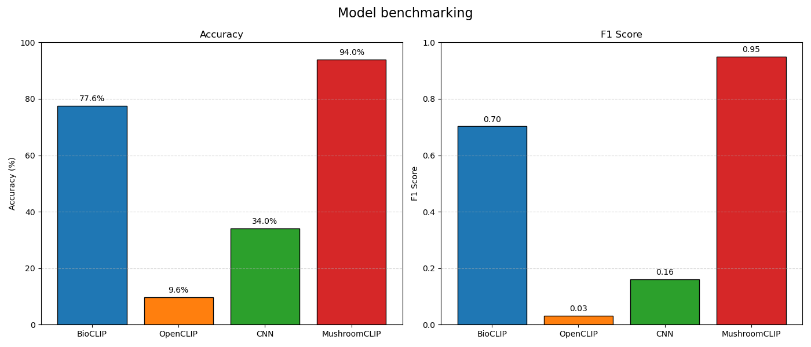

# MushroomCLIP Documentation


[Haydenrjones, CC BY-SA 4.0](https://commons.wikimedia.org/wiki/File:Pholiota_aurivella.png)

## Introduction

The aim of this project is to fine-tune an existing open source version of the CLIP model [[1]](https://arxiv.org/abs/2103.00020), developed originally by OpenAI and later open-sourced by various contributers under the name OpenCLIP and compare it's performance to a previously created adaption called BioCLIP [[2]](https://arxiv.org/abs/2311.18803), which has been trained on a dataset consisting of 10M images of plants, animals, and fungi, as well as the structured biological knowledge. Since the creation of the first BioCLIP model, there has been a version 2 released, which increased the size of the training data to 200M images.

The goal was to see, if fine-tuning a similarly sized model with specific domain knowledge, which in this project was knowledge about various classes of mushrooms, could perform equally or even better then a model trained much more intently on a much larger dataset.

## Data

### Acquisition

The dataset consisting of ~100'000 images of different mushroom classes was adapted from a previously created Kaggle challenge [[3]](https://www.kaggle.com/datasets/zlatan599/mushroom1). After downloading the dataset, the final size came out to 12.2 GB of data made up of 169 individual classes of mushrooms spanning a total of 104'100 images. We split the data into three different parts: training (80%), testing (10%) and validation (10%). Initial analysis of the dataset did not reveal any imbalances to be taken care of so we agreed to continue to benchmarking the selected models before fine-tuning, to assess their zero-shot capabilities before any fine-tuning.

## Model

### Benchmark CNN model

A convolutional neural network (CNN) was implemented in PyTorch to establish a baseline for the mushroom image classification task. The baseline model was iteratively improved through a structured hyperparameter tuning and model optimization process, and its performance was later used as a reference for comparison with a CLIP-based model.

Starting from a minimal CNN trained for two epochs with basic resizing, the model initially achieved very low accuracy. Successive training cycles introduced input normalization and data augmentation techniques such as random rotations and horizontal flips, which led to gradual performance improvements. A major increase in accuracy and training stability was achieved by adding batch normalization layers after the convolutional layers.

Further gains were obtained by increasing the model capacity through wider convolutional layers and reducing the batch size to accommodate the larger network. The introduction of residual blocks enabled deeper feature learning and improved gradient flow. Finally, extending the training duration from two to six epochs resulted in the best baseline performance.

Overall, the CNN baseline accuracy improved from approximately 7% to 34% through systematic architectural changes, data preprocessing enhancements, and longer training. This optimized CNN served as a baseline for subsequent comparison with a CLIP model on the same classification task.

It is important to note that because of the class imbalances observed in the data inspection part, the CNN model was strongly biased towards overrepresented classes.
When looking at the accuracy scores for the individual classes one can observe that for the class with the most pictures "Xanthoria parietina", which includes about 6000 pictures, the model reaches an accuracy of 94%. In contrast, for classes like "Suillus granulatus", which only includes about 200 examples, the model only reaches an accuracy of 0.0%, missclassifying all of the pictures.

### Model Specifications and Sources

The BioCLIP model we chose to use was the original version [[4]](https://huggingface.co/imageomics/bioclip), which was trained on the 'TreeOfLife-10M' dataset. The basis of this model is the CLIP model version 'ViT-14/L' [[5]](https://huggingface.co/openai/clip-vit-base-patch16) trained on on a proprietary 'WIT-400M' dataset by OpenAI. Compared to the first BioCLIP iteration, the second version called 'bioclip-2' contains significantly more parameters (86M vs 304M) [[6]](https://imageomics.github.io/bioclip/),[[7]](https://arxiv.org/abs/2505.23883). Because we were unsure wether we wanted to scope to the project to include fine-tuning both a CLIP as well as a BioCLIP model, we chose to stick with the smaller sized 'BioCLIP' model, instead of the much larger 'bioclip-2'.

The CLIP model we chose to use was the 'ViT-B-32' version, which was trained on the same proprietary 'WIT-400M' dataset from OpenAI, though the model weights are available [[8]](https://huggingface.co/openai/clip-vit-base-patch32/tree/main). The reason behind not choosing the same 'ViT-14/L' model as our basis was because we wanted to see if using a model using a larger patch size could still retain enough details from the training to perform well enough, without having to invest the computational load to fine-tune the finer grained model.

### Model Architecture and Methodology

This project provides a VS Code Dev Container [[9]](https://code.visualstudio.com/docs/devcontainers/containers) configuration that launches the required dependencies. The base image is the Nvidia PyTorch container [[10]](https://catalog.ngc.nvidia.com/orgs/nvidia/containers/pytorch?version=25.11-py3) `nvcr.io/nvidia/pytorch:25.11-py3`, which includes GPU optimizations and support for the GB10 chip we used for this project.

The repository structure was organized keeping ease of use and simplicity in mind like this:

```text
CO5_image_classification_project/
├── data/ 
├── img/ 
├── src/ 
│ ├── benchmark.py
│ ├── evaluation.py
│ ├── preprocessing.py
│ └── tuning.py
├── .gitignore
├── README.md
├── config.yaml
├── .devcontainer
└── project.ipynb
```

User-configurable variables are organized within `config.yaml` using chapters, allowing them to be called individually by each script via the `load_config` function. The implementation is shown below:

```yaml
### config.yaml chapter structuring
data:
  DATASET_PATH: 'path/to/data'
  IMAGE_SIZE: 224
  BATCH_SIZE: 256
```

```python
def load_config(config_path="./config.yaml"):
    with open(config_path, "r") as f:
        return yaml.safe_load(f)
```

This function is utilized by all scripts requiring variable access. The following snippets demonstrate how it was used within the code:

```python
### example for accessing a config chapter inside 'preprocessing.py'
cfg = load_config()
data_cfg = cfg['data']
model_cfg = cfg['model']

### example usage of a specific variable from a config chapter inside 'preprocessing.py'
dataset = datasets.ImageFolder(
    root=data_cfg['DATASET_PATH'],
    transform=transform
)
```

important functions such as the data gathering function `get_data` were written inside their own .py scripts and combined in the main project file `project.ipynb` where these functions were then called and used for the full project pipeline:

```text
data import -> data processing -> model fine-tuning -> model evaluation
```

### Training/fine-tuning -> __Curdin schreibt__

After gathering these first insights into the models behaviour it was decided to move on to training the selected CLIP model using a fine-tuning approach. During the lectures from the CO5 course, we have already learned about using Low-Rank Adaptation (LoRA) [[11]](https://arxiv.org/abs/2106.09685) for efficient model tuning. We searched for a framework that allowed us to use LoRA in a straightforward way without having to develop our own system and found the 'peft' library developed by huggingface [[11]](https://huggingface.co/blog/peft),[[12]](https://arxiv.org/abs/2312.12148) that allows for the easy implementation of different fine-tuning approaches into an already existing training + inference loop.

### Experimentation

```python
tuning.py
```

```python
training.py
```

Talk about how we set up the tuning using the peft and LoRA setups and how we fed those into our training and inference loop.

## Results

After gathering all of the results, from the non fine-tuned as well as the fine-tuned versions, we could analyze them in a single graphic. As is visible in the figure below, the non fine-tuned models all performed below the fine-tuned version of the CLIP models. These results were achieved after 3 epochs of training the model on the training partition of the dataset, with the testing portion being used for benchmark testing.

Due to the way the model was fine-tuned, it was required to have two different benchmarking scripts. 



## Lessons learned and challenges faced

Two different scripts were required for testing because of the specific way the model was fine-tuned. The standard models were tested using the open_clip library. However, the peft library was needed for the fine-tuned model because it was built using a special adapter method. 

Additionally, the dataset was found to be imbalanced, meaning some species were very common while others were rare, as previously illustrated in `project.ipynb`. To address this, a weighted loss function was used during training so that rare species were not ignored. Finally, the Macro F1-score was chosen over simple accuracy for the final results. This metric was selected because equal importance is given to all species by it, regardless of how many images were available for them.

<!-- ## Project grading

From the MSLS pdf:

- [x] Choose a task that can be solved with common gen AI model discussed in the course. Unorthodox and risky yet sound tasks whose result would be difficult to assess are also welcomed. Explain the task to be solved. (5 scores) *Used models from the CLIP family, but adapted them using a previously created framework*

- [x] Search for an appropriate data set for your task. Describe the dataset. (5 scores) -> *used Kaggle dataset for the project and explained it's content*

- [x] Point out, possibly, related work, problems, or tasks in the literature. (5 scores) -> *Talked about the creation of BioCLIP model in the introduction*

- [x] Preprocess your data and explain the process. (5 scores) -> *Talk about the preprocessing script*

- [ ] Explain your model, the model architecture, parameters, methods, etc. (5 scores)

- [ ] Experiment with your model. Change it, tune hyperparameters, etc. Do not copy-paste a model without substantially adopting it to your task. Explain your final model. (15 scores)

- [ ] Explain and visualize your results. (5 scores)

- [ ] List the lessons you learned and challenges you faced during the project. Point out further work or ideas. (5 scores) -->
